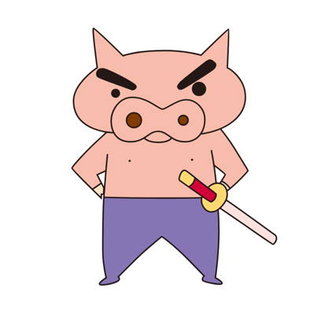

# 🖥 프로젝트 명 'CookLog'

CookLog는 자취생들을 위한 집밥 소개 SNS입니다!  
꼭 자취생이 아니더라도 자신이 만든 요리라면 공유할 수 있습니다! 
CookLog를 통해 자신의 요리를 업로드하고, 다른 사용자들의 요리를 탐색하며 소통 할 수 있습니다. 
신선한 요리 아이디어와 다양한 레시피를 공유하고 발견할 수 있는 CookLog로 요리하는 즐거움을 함께 누려보세요!
  
[클릭하여 페이지를 방문하세요](http://ec2-43-202-107-97.ap-northeast-2.compute.amazonaws.com:8080/)
 

# 👩‍👧‍👦 개발 인원 및 역할

<table style="width: 100%;">
 <tr>
    <td align="center" style="width: 25%;"></td>
    <td align="center" style="width: 25%;"></td>
    <td align="center" style="width: 25%;"></td>
    <td align="center" style="width: 25%;"></td>
  </tr>
  <tr>
    <td align="center"><a href="https://github.com/HuiGyun-kim"><b>kimhuigyun</b></a></td>
    <td align="center"><a href="https://github.com/dhktjr0204"><b>jeongjiwon</b></a></td>
    <td align="center"><a href="https://github.com/hongju1234"><b>namhongju</b></a></td>
    <td align="center"><a href="https://github.com/kanghanju"><b>kanghanju</b></a></td>
  </tr>
  <tr> 
    <td align="center">Backend, Front</td>
    <td align="center">Backend, Front</td>
    <td align="center">Backend, Front</td>
    <td align="center">Backend, Front</td>
  </tr> 
  <tr> 
    <td align="center">ERD 설계 댓글 API 개발 관리자 API 개발 신고 API 개발 Spring Security UI 개발(메인페이지, 게시물, 댓글, 관리자페이지) JavaScript 개발(댓글, 신고)</td>
    <td align="center">화면 설계 ERD 설계 메인페이지 API 개발 게시물 API 개발 텍스트 및 태그 검색 API 개발 S3를 이용한 사진 업로드 및 사진 삭제 프로필 수정 API 개발 UI 개발(게시물) JavaScript 개발(글자 수 세기,무한 스크롤, 검색, 게시물, 메인 페이지, 마이페이지 수정) 프로젝트 배포</td>
    <td align="center">요구사항 및 기능 명세 Spring Security 로그인 API 개발 마이페이지 API 개발 UI 개발(마이페이지) JavaScript 개발(마이페이지)</td>
    <td align="center">ERD 설계 좋아요 API 개발 북마크 API 개발 팔로우 API 개발 메인페이지 API 개발 UI 개발(북마크, 팔로우) JavaScript 개발(좋아요, 북마크, 팔로우, 메인 페이지)
    </td>
  </tr> 
</table>

 

# 📆 프로젝트 일정

2024/03/25(월) ~ 2024/04/05(금)

 

# 📚 기술스택

### [기술 - FE]

  

### [기술 - BE]

  

### [기술 - DB]

 

### [개발 환경]

  

 

# 🛠 아키텍처 설계도

 

# 🗂 DB 구성도

# 🖼 UI

|                            로그인 화면                             |                             회원가입 화면                            |
|:-------------------------------------------------------------:|:--------------------------------------------------------------:|
|      |     |
|                          <b>마이페이지 화면                          |                          <b>프로필 수정 화면                          |
|  |  |
|                           <b>북마크 화면                           |                          <b>팔로워,팔로잉 화면                         |
|      |       |
|                           <b>메인 화면                            |                            <b>게시글 화면                           |
|     |   |
|                           <b>검색 화면                            |                          <b>관리자 메인 화면                          |
|        |  |
|                          <b>글 관리 화면                           |                           <b>댓글 관리 화면                          |
|    |   |
|                        <b>신고 유저 관리 화면                         |                           <b>                          |
|   |      |

# 👉 주요 기능

## 1. 메인 페이지

### [무한 스크롤로 구현된 게시글 목록 조회 기능]
- 사용자가 웹 페이지를 스크롤할 때마다 추가 게시글이 자동으로 로드됩니다. 이를 통해 사용자는 페이지 이동 없이 연속적으로 게시글을 볼 수 있습니다.
- 최신순, 조회순, 좋아요순으로 정렬할 수 있습니다.
- 팔로워만 보기는 현재 로그인한 사용자가 팔로우한 유저들의 게시글만을 보여줍니다. 이를 통해 자신이 관심 있는 유저들의 활동을 중심으로 게시글을 확인할 수 있습니다.
- 새로고침된 시점에 형성되어 있는 게시물만 보여줌으로써 게시물의 중복 노출을 방지하였습니다.

 

## 2. 텍스트 검색과 태그 검색 기능

### [텍스트 검색 기능]
- 검색장에 특정 텍스트를 입력하면 해당 텍스트를 포함한 게시물들을 모두 볼 수 있습니다.
- 검색 시점에 형성된 게시물만을 보여줘 게시물의 중복 노출을 방지하였습니다.

### [태그 검색 기능]
- 검색창에 "#"를 입력하여 태그 검색을 할 수 있습니다.
- 단일 태그 검색 뿐만 아니라 다중 태그 검색도 가능합니다. 다중 태그 검색일 경우 해당하는 태그 중 하나라도 포함된 게시물을 모두 보여줍니다.
- 검색 시점에 형성된 게시물만을 보여줘 게시물의 중복 노출을 방지하였습니다.

 

## 3. 게시글 CRUD

### [게시글 기능]
- 최대 10개 까지의 태그를 추가할 수 있습니다. 태그 추가는 'enter' 또는 'space'를 이용해서 생성할 수 있습니다.
- 사용자는 최소 한 개의 이미지를 첨부해야만 게시글을 작성할 수 있습니다. 이미지는 최대 10개까지 첨부 가능합니다.
- 글 작성 도중에 삭제하고 싶은 이미지를 삭제할 수 있습니다.

### [게시글 길이 제한]
- 게시글의 내용은 최대 500자까지 작성할 수 있습니다.
- 사용자가 500자를 초과하여 입력하려고 할 경우, 초과된 부분은 자동으로 삭제되며, 사용자에게 경고 메시지를 띄웁니다.

### [이미지 슬라이더 기능]
- 게시글의 이미지를 하나씩 넘겨서 볼 수 있습니다.
- 마지막 이미지에서 다음 페이지를 누르면 첫 번째 이미지로 이동합니다.

 

## 4. 댓글 CRUD

### [댓글 기능]
- 사용자는 게시글 하단에 댓글을 작성할 수 있습니다. 이를 통해 다른 사용자와 소통하고 의견을 나눌 수 있습니다.
- 작성된 댓글은 작성자의 닉네임 또는 프로필 사진과 함께 표시됩니다.
- 페이지 당 5개의 댓글이 표시됩니다.
- 댓글 작성시 새로고침하지 않고도 최상단에 바로 생성됩니다.
- 댓글 수정, 삭제 또한 바로 수정, 삭제된 것을 확인할 수 있습니다.

 

## 5. 좋아요 기능과 북마크 기능

### [좋아요 기능]
- 사용자는 좋아요 버튼을 눌러 좋아요를 할 수 있습니다.
- 누르면 하트 아이콘이 활성화되어 표시되고, 해당 게시글의 좋아요 수가 증가합니다.
- 이미 좋아요를 눌렀던 게시글에 다시 누르면 좋아요가 취소되고 하트 아이콘이 비활성화됩니다.

### [북마크 기능]
- 게시글 목록 중 다시 보고 싶은 게시물은 북마크 기능을 통해 저장할 수 있습니다.
- 북마크가 된 게시물을 한 번 더 누르면 취소됩니다.
- 북마크한 게시물은 사용자의 마이페이지 북마크 탭에서 확인할 수 있습니다.

 

## 6. 마이페이지 기능

### [마이페이지 기능]
- 사용자가 작성한 게시글을 확인할 수 있는 페이지입니다. 이를 통해 자신의 활동을 한눈에 볼 수 있습니다.
- 마이페이지에서는 사용자의 ID, 인삿말, 프로필 사진을 변경할 수 있습니다.
- 북마크탭에서 북마크로 저장한 게시글을 확인 할 수있습니다.
- 다른 사용자를 팔로우하거나 언팔로우 할 수 있습니다. 자신의 마이페이지인 경우 팔로우 버튼이 뜨지 않습니다.
- 로그아웃 및 탈퇴를 할 수 있습니다.

 

## 7. 팔로우 언팔로우 기능

### [팔로우 기능]
- 활동을 계속 보고 싶은 다른 사용자를 팔로우할 수 있습니다. 이를 통해 팔로우 한 사용자가 업로드한 컨텐츠를 손쉽게 확인할 수 있습니다.
- 언팔로우 기능을 통해 팔로우를 해제할 수 있습니다.
- 마이페이지에서는 팔로우 또는 팔로잉한 사용자들의 목록을 볼 수 있습니다. 이를 통해 자신이 팔로우한 사용자들 또는 자신을 팔로잉한 사용자들을 한눈에 확인할 수 있습니다.
- 팔로우 또는 팔로잉된 사용자는 10개씩 보여집니다.

 

## 8. 신고 기능

### [신고 기능]
- 사용자가 커뮤니티 내에서 부적절한 활동을 하는 다른 사용자를 신고할 수 있는 기능입니다.
- 신고가 4번 이상 누적된 사용자는 관리자에게 전달되어 검토됩니다.
- 이를통해 불쾌한 콘텐츠나 상호작용을 방지하고 커뮤니티의 안전을 유지할 수 있습니다.

### [블랙리스트 기능]
- 신고가 4회 이상 누적되어 관리자가 해당 사용자를 블랙리스트에 등록하면, 해당 사용자의 활동이 제한됩니다.
- 30일동안 블랙리스트에 유지되며, 이 기간 동안 사용자는 글 작성 및 수정이 불가능하며 글 작성 페이지와 수정페이지에 접근할 수 없습니다.
- 30일 이후 블랙리스트에서 해제되며 신고 누적 횟수는 0으로 초기화됩니다. 해제된 사용자는 다시 커뮤니티에서 활동할 수 있습니다.

## 9. 관리자 기능

### [등급 기능]
- 처음 로그인한 유저는 미식 초보로 분류됩니다.
- 사용자가 작성한 글이 5개 이상일 경우 요리 연습생, 좋아요가 10개 이상인 경우는 요리전문가로 분류됩니다.
- 등급은 매시간마다 확인되며 자동으로 상승됩니다.
- 관리자는 전체 유저 관리 페이지를 통해 사용자들의 등급을 한눈에 확인하고 수정할 수 있습니다.

### [댓글 및 게시글 관리]
- 관리자는 게시글 및 댓글 관리페이지를 통해 사용자들이 작성한 게시글 및 댓글을 한눈에 볼 수 있습니다.
- 삭제 버튼을 통해 사용자들의 게시글 및 댓글을 삭제할 수 있습니다.
- 이를 통해 관리자는 커뮤니티 내에서 부적절한 콘텐츠를 신속하게 발견하고 삭제할 수 있습니다.
- 작성글 및 댓글은 5개씩 표시됩니다.

### [신고 관리]
- 관리자는 신고가 4번 이상 누적된 사용자들을 한눈에 볼 수 있습니다.
- 4번 이상 신고된 사용자의 활동을 확인한 후, 필요하다고 판단되면 해당 사용자를 블랙리스트에 등록합니다.
- 이를 통해 관리자는 신고가 누적된 사용자들의 활동을 모니터링하고 조치를 취할 수 있습니다.